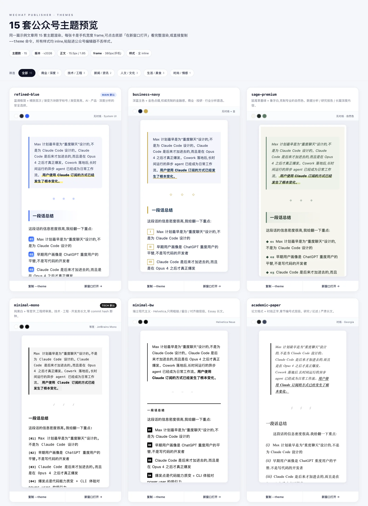
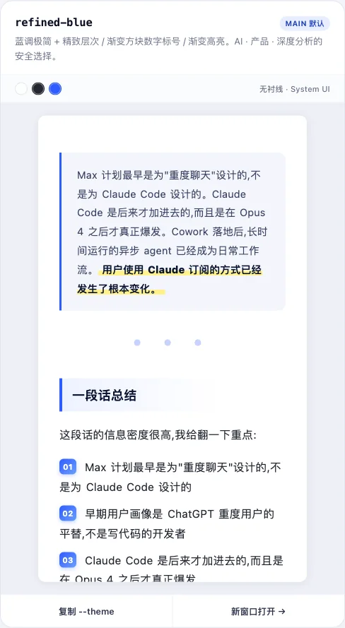
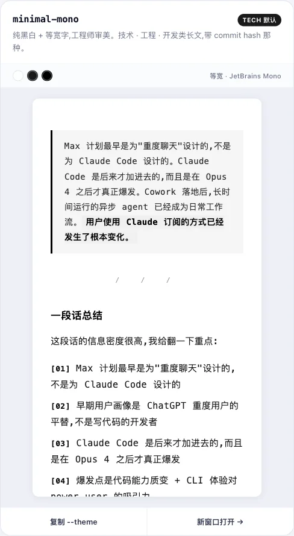
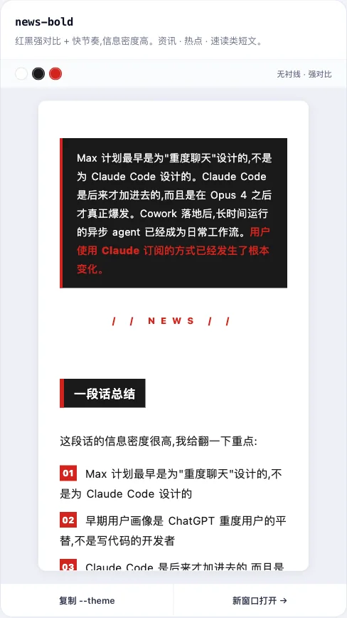
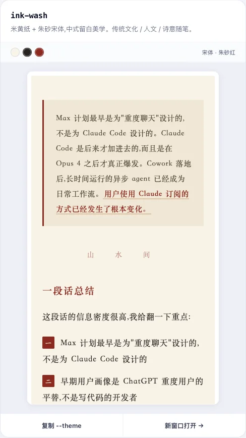

# wechat-publisher

微信公众号文章自动创作与发布工具。从选题搜索、文章撰写、AI配图生成、排版美化到发布草稿箱,一条命令搞定全流程。

可作为 [Claude Code](https://claude.ai/code)、Codex、OpenClaw 的 Skill 使用,也可以独立命令行调用。

## 安装

作为 Claude Code / Cursor / Copilot Skill 使用(通过 [skills.sh](https://skills.sh) 注册):

```bash
npx skills add jiji262/wechat-publisher
```

或手动放入 `~/.claude/skills/`:

```bash
git clone https://github.com/jiji262/wechat-publisher.git ~/.claude/skills/wechat-publisher
cp ~/.claude/skills/wechat-publisher/wechat-publisher.yaml.example ~/.claude/skills/wechat-publisher/wechat-publisher.yaml
# 编辑 wechat-publisher.yaml 填入公众号、生图、同步等配置
pip install requests pyyaml
```

首次用调 `python3 scripts/wechat_api.py list-accounts` 确认账号配置 OK,再跑 `python3 -c "from wechat_api import get_access_token; print(get_access_token()[:10])"` 验证 API 连通。遇到 `40164` 报错就把 `curl ifconfig.me` 拿到的公网 IP 去[公众平台](https://mp.weixin.qq.com)后台加白名单。

## 功能特性

- **全网素材搜索**:围绕话题自动多轮搜索,交叉验证数据,筛选最新案例和权威观点
- **AI智能写作**:按照头部博主风格生成3000-5000字深度文章,反AI味写作规则,段落短小有呼吸感
- **AI配图生成**:通过项目内置 `scripts/generate_image.py` 为每个章节生成风格统一的手绘信息图(6-10张/篇),默认走 `baoyu-image-gen`,也可切到 Web 登录版 Gemini
- **微信排版转换**:Markdown → 微信兼容 HTML,所有样式自动内联,内置 **16 套主题(v2026)**,覆盖 AI/技术/商业/新闻/人文/生活/时尚 7 大场景,见下方[排版主题](#排版主题)章节
- **图片CDN上传**:自动上传图片到微信服务器,获取 `mmbiz.qpic.cn` 链接并替换占位符
- **一键发布草稿**:封面图、标题、摘要、作者全部自动填好,直达草稿箱
- **反 AI 检测 gate**:`ai_score.py` 按 burstiness / 套话 / 词汇 / 结构 / 标点 5 维打分,publish.py 发布前自动拦截高分稿
- **爆款标题公式**:内置5种10w+标题写法(痛点+方案+数字、身份代入+结果、反常识/悬念等)

## 项目结构

```
wechat-publisher/
├── SKILL.md                    # 通用 Skill 定义文件(7 阶段工作流,第 7 阶段为可选)
├── README.md                   # 项目说明
├── wechat-publisher.yaml       # 统一配置(公众号/生图/同步,gitignored)
├── wechat-publisher.yaml.example # 统一配置模板
├── .gitignore
├── scripts/
│   ├── publish.py              # 一键发布主流程(串联所有模块 + AI 味 gate)
│   ├── wechat_api.py           # 微信 API facade + CLI 入口(重导出 config/token/api)
│   ├── config.py               # wechat-publisher.yaml 加载 + ConfigError
│   ├── wechat_token.py         # access_token 获取与本地缓存
│   ├── api.py                  # 图片上传 / 草稿创建 / 发布
│   ├── html_converter.py       # Markdown → 微信 HTML(16 套主题 + 行内标色 + list_style)
│   ├── image_handler.py        # 图片下载 / 上传 / 替换
│   ├── ai_score.py             # 反 AI 检测自检(publish.py 自动调用)
│   ├── newspic_build.py        # 贴图(图片消息)模式:brief.md → card_plan.json
│   └── multi_publish.py        # 可选:同步到知乎/掘金/CSDN(基于 @wechatsync/cli)
├── assets/
│   ├── themes/                 # 排版主题(16 套 .json)
│   ├── theme-previews/         # 16 套主题的 HTML 预览(index.html 并排对比)
│   └── image-styles/           # 9 套配图风格(.json + previews/*.webp)
├── references/
│   └── api_reference.md        # 微信公众平台 API 参考(节选)
├── brief.md.example            # newspic 贴图模式 brief 模板
├── tests/                      # pytest 测试套件(不依赖真实微信凭证)
└── references/
    └── api_reference.md        # 微信API接口文档
```

## 快速开始

### 1. 克隆项目

```bash
git clone https://github.com/jiji262/wechat-publisher.git
cd wechat-publisher
```

### 2. 安装依赖

`pyyaml` 是硬依赖(读 `wechat-publisher.yaml`),`requests` 用于 HTTP 调用:

```bash
pip install requests pyyaml --break-system-packages
```

### 3. 配置微信公众号

登录 [微信公众平台](https://mp.weixin.qq.com) → 设置与开发 → 基本配置:

1. 获取 AppID 和 AppSecret(首次使用需启用开发者密码)
2. 在「IP白名单」中添加当前机器的公网IP(`curl ifconfig.me` 查询)
3. 复制 `wechat-publisher.yaml.example` 到 `wechat-publisher.yaml` 并填入真实凭证和生图配置:

```yaml
default: main
accounts:
  main:
    name: "我的公众号"
    app_id: "wx..."
    app_secret: "..."
    author: "飞哥"

image_generation:
  generator: "baoyu-image-gen"
  gemini_proxy:
    base_url: "https://website-data-analysis.replit.app"
    api_key: "cr_..."
    image_model: "gemini-3-pro-image-preview"

integrations:
  wechatsync_mcp_token: ""
```

`wechat-publisher.yaml` 是唯一支持的配置文件,只从 skill 根目录读取。

### 3.1 配置生图后端

项目内置统一生图入口 `scripts/generate_image.py` 不依赖外部 baoyu skills。默认后端是 `baoyu-image-gen`,也就是本项目内置的 `scripts/baoyu_image_gen.ts`;可配置为 `baoyu-danger-gemini-web`,使用本项目内置拷贝的 Web 登录版 Gemini。

默认 `baoyu-image-gen` 支持两种 provider:

1. `openai`
2. `gemini-proxy`(Gemini CLI / chat 代理)

生图后端选择有两种:

1. `baoyu-image-gen`:默认,支持 OpenAI Images 和 Gemini CLI / chat 代理
2. `baoyu-danger-gemini-web`:Web 登录版 Gemini,使用 `scripts/baoyu_danger_gemini_web/`,需要本机已保存 Gemini Web 登录 cookie

所有生图凭证都放在 `wechat-publisher.yaml` 的 `image_generation` 下。

### 4. 验证连接

```bash
cd scripts
python3 -c "from wechat_api import get_access_token; print('连接成功:', get_access_token()[:10]+'...')"
```

或列出已配置账号:

```bash
python3 scripts/wechat_api.py list-accounts
```

## 使用方式

### 方式一:安装到 Agent 客户端(推荐)

本项目的核心入口是根目录下的 `SKILL.md`,推荐用**软链接**安装。这样后续只要更新当前仓库,Claude、Codex、OpenClaw 都会自动读到最新版本,不需要重复复制。

#### Claude Code

推荐安装:

```bash
mkdir -p ~/.claude/skills
ln -s "$(pwd)" ~/.claude/skills/wechat-publisher
```

如果目标目录已存在,可先删除旧目录,或改用复制安装:

```bash
cp -R "$(pwd)" ~/.claude/skills/wechat-publisher
```

安装后重启 Claude Code,或开启一个新会话让 skill 被重新发现。

#### Codex

推荐安装:

```bash
mkdir -p ~/.codex/skills
ln -s "$(pwd)" ~/.codex/skills/wechat-publisher
```

如果你不想使用软链接,也可以复制:

```bash
cp -R "$(pwd)" ~/.codex/skills/wechat-publisher
```

安装后重启 Codex,让新的 skill discovery 生效。

#### OpenClaw

OpenClaw 支持两种放置方式:

- **共享安装**:放到 `~/.openclaw/skills/`,所有 agent 共用
- **工作区安装**:放到 `<workspace>/skills/`,只在该工作区内生效,且优先级更高

共享安装示例:

```bash
mkdir -p ~/.openclaw/skills
ln -s "$(pwd)" ~/.openclaw/skills/wechat-publisher
```

工作区安装示例:

```bash
mkdir -p /path/to/openclaw-workspace/skills
ln -s "$(pwd)" /path/to/openclaw-workspace/skills/wechat-publisher
```

安装后执行以下命令验证并刷新:

```bash
openclaw skills list
openclaw gateway restart
```

如果你正在聊天会话中,也可以直接新开一个会话来重新加载 skill。

#### 使用示例

安装完成后,在支持 slash skill 或自然语言触发的客户端里都可以这样使用:

```
使用 /wechat-publisher 写一篇关于"大模型Agent最新进展"的公众号文章
```

也支持更具体的指令:

```
使用 /wechat-publisher 根据这篇论文写一篇公众号文章,
目标读者是AI开发者,风格偏技术科普,重点解读实验结果
```

或者提供参考资料:

```
使用 /wechat-publisher 基于以下3篇文章综合写一篇分析,
文章1: [URL]
文章2: [URL]
```

Skill 会自动执行 7 阶段工作流(第 7 阶段为可选):搜索素材 → 撰写文章 → 人味化改写 → 生成配图 → 转换排版 → AI 味自检 gate → 发布草稿 → (可选)多平台同步。

### 方式二:命令行调用

**一键发布(Markdown → 草稿箱)**:

```bash
python3 scripts/publish.py \
  --account main \
  --input article.md \
  --cover cover.jpg \
  --title "文章标题" \
  --digest "文章摘要"
```

`publish.py` 会自动从 `wechat-publisher.yaml` 读 `author` / `theme`,再依次做图片处理 → HTML 转换 → AI 味检测 → 封面上传 → 创建草稿。默认阈值 45,过关才会继续。

常用可选参数:

- `--ai-score-threshold 45` —— 调整 AI 味检测阈值
- `--skip-ai-score` —— 跳过 AI 味 gate(不建议,仅用于明确已通过人工审校的情况)
- `--debug` —— 把中间产物 `article_output.html` 写到临时目录(默认使用 `tempfile.mkdtemp()`)
- `--sync zhihu,juejin` 或 `--sync-from-config` —— 阶段 7 多平台同步(opt-in)

**从已有HTML发布**:

```bash
python3 scripts/publish.py --account main --html article.html --cover cover.jpg --title "标题"
```

**只做格式转换(Markdown → 微信HTML)**:

```bash
python3 scripts/html_converter.py article.md --theme refined-blue -o article.html
```

**只处理图片**:

```bash
# 上传单张图片到微信CDN
python3 scripts/image_handler.py upload photo.jpg

# 批量处理文章中的所有图片链接
python3 scripts/image_handler.py process article.md -o article_processed.md
```

**手动跑一次 AI 味检测**(publish.py 已内置,这里仅用于写作时单独检查):

```bash
python3 scripts/ai_score.py article.md --threshold 45
```

每个脚本都支持 `--help` 查看完整参数。

## 排版主题

内置 **16 套主题(v2026)**,位于 `assets/themes/*.json`。所有主题都遵守:正文 ~15.5px、行高 ~1.85、纯 inline style、无外部依赖,粘贴进公众号编辑器不丢样式。

> **想直观看效果?** 打开 [`assets/theme-previews/index.html`](assets/theme-previews/index.html),16 套主题用同一篇文章渲染在手机宽度 frame 里并排对比,带分类筛选和色板预览。

### 主题截图

下面这组图直接来自 `assets/theme-previews/index.html` 的静态截图,和 HTML 预览使用同一篇样例文章,方便在 GitHub 里快速比对主题观感。



<table>
<tr>
<td width="50%">

<br />
<code>refined-blue</code> · main 默认,适合 AI / 产品 / 深度分析
</td>
<td width="50%">

<br />
<code>minimal-mono</code> · tech 默认,适合技术 / 工程文章
</td>
</tr>
<tr>
<td width="50%">

<br />
<code>news-bold</code> · 适合新闻 / 热点 / 速读
</td>
<td width="50%">

<br />
<code>ink-wash</code> · 适合人文 / 随笔 / 文化
</td>
</tr>
</table>

### 按文章气质挑选

| 类别 | 推荐主题 | 视觉关键词 |
|---|---|---|
| **AI / 产品 / 深度分析** | `refined-blue` **(main 默认)** · `business-navy` · `sage-premium` | 蓝调 / 深蓝金 / 鼠尾草绿 |
| **技术 / SDK / 工程** | `minimal-mono` **(tech 默认)** · `minimal-bw` · `academic-paper` · `cyber-neon` | 等宽 / 黑白 / 论文衬线 / 赛博霓虹 |
| **新闻 / 热点 / 速读** | `news-bold` · `warm-editorial` | 红黑强对比 / 栗色暖调 |
| **人文 / 随笔 / 文化** | `ink-wash` · `elegant-ink` · `magazine-grid` | 米黄朱砂 / 墨黑朱砂 / 杂志衬线 |
| **生活 / 美食 / 旅行** | `warm-orange` · `mint-fresh` · `sunset-coral` | 暖橙 / 薄荷 / 珊瑚 |
| **时尚 / 美妆 / 情感** | `girly-pink` · `sunset-coral` | 粉紫渐变 / 暖橙奶白 |

或直接命令行列出:

```bash
python3 scripts/html_converter.py --list-themes
```

### `refined-blue` 默认样式亮点

| 元素 | 样式 |
|------|------|
| 主色调 | `#2e5bff`(精致蓝)+ `#0b1530`(深藏青) |
| 正文 | 15.5px / 1.85 行高 / 0.35px 字间距 |
| 二级标题 | 蓝色左边框 + 渐变背景 + 圆角 |
| 引用块 | 浅蓝底 + 蓝色左边框 + 圆角 |
| 代码块 | 深色 `#0f1729` / 10px 圆角 / 细边框 |
| 图片 | 8px 圆角 + 柔和阴影 + 浅蓝边框 |
| 有序列表 | 渐变方块数字标号(02 位补零) |
| 无序列表 | 蓝紫渐变小圆点 |
| 粗体强调 | 深藏青 + 渐变黄色下划线 |

### 主题文件结构

每个主题是 `assets/themes/<theme>.json`,4 个关键字段:

| 字段 | 作用 |
|---|---|
| `styles` | 各标签(body / h1~h3 / p / blockquote / ul / ol / li / hr / a / table / code_block / 等)的 inline style |
| `highlights` | 7 种行内标记的样式:`hl_yellow` / `hl_blue` / `hl_pink` / `hl_green` / `em_red` / `em_blue` / `em_orange` |
| `section_divider_text` | `===` / `[SEC]` 渲染出的分节字符,如 `● ● ●` / `— — —` / `§ § §` |
| `list_style` | 有序/无序列表的数字 / 项目符号样式。`num_formatter` 可选 `decimal` / `padded` / `chinese` / `roman_upper` / `roman_lower` / `circled` / `circled_filled` |

### 自定义 / 新增主题

复制任意一份 `assets/themes/*.json`、改个名字、改键即可。**不需要改 `html_converter.py`**,新主题立刻可用:

```bash
cp assets/themes/refined-blue.json assets/themes/my-brand.json
# 编辑 my-brand.json,改 styles / highlights / list_style
python3 scripts/html_converter.py article.md --theme my-brand -o preview.html
```

### v2026 升级说明

如果你从老版本(6 套主题)升级到 v2026,有 3 个变化:

1. **主题数 6 → 16**,所有原有主题名(`refined-blue` / `minimal-mono` / `elegant-ink` / `sage-premium` / `sunset-coral` / `warm-editorial`)保留并升级,直接调用即可
2. **新分节符语法**:除了原有的 `===`,现在也支持 `[SEC]` 单独一行(等价)
3. **主题可控的列表样式**:`list_style.num_formatter` 让有序列表的数字在不同主题里有不同视觉(渐变方块 / 中文一二三 / 圆圈数字 / 罗马数字…)。老主题已统一升级,不需要手动迁移

## 脚本说明

### publish.py - 一键发布

串联所有模块:读取 Markdown → 处理图片 → 转换 HTML →**AI 味 gate** → 上传封面 → 创建草稿。

作者和主题从 `wechat-publisher.yaml` 对应账号自动读取,也可通过 `--author` 覆盖。

### wechat_api.py - 微信 API facade

本文件现在只是一个 facade,重导出以下模块并提供 CLI(`python3 scripts/wechat_api.py list-accounts / token / upload-thumb / draft`):

- **`config.py`**:`wechat-publisher.yaml` 解析、`ConfigError`、`set_account` / `get_config` / `list_accounts`
- **`wechat_token.py`**:`get_access_token`,本地文件缓存,过期前5分钟自动刷新
- **`api.py`**:`upload_content_image` / `upload_thumb_image` / `add_draft` / `publish_article`

老代码中的 `from wechat_api import ...` 保持不变。

### html_converter.py - Markdown 转换器

处理微信编辑器的特殊限制:
- 所有 CSS 样式内联到每个标签的 `style` 属性
- HTML 实体转义(`<script>` 等标签不会被误解析,`javascript:` URL 不会生效)
- 支持标题、段落、列表、引用块、代码块、表格、图片、链接等 Markdown 语法
- 自定义行内标记(`==黄==` / `++蓝++` / `%%粉%%` / `&&绿&&` / `!!红!!` / `@@蓝@@` / `^^橙^^`)
- 分节符:`===` 或 `[SEC]` 单独一行,渲染为主题自带的分节字符
- 主题级 `list_style`:每套主题可定义自己的有序列表数字样式(阿拉伯 / 中文 / 罗马 / 圆圈)和无序列表项目符号

### image_handler.py - 图片处理

支持三种操作模式:
- `upload`:上传本地图片到微信 CDN
- `download`:从 URL 下载图片到本地
- `process`:批量替换文章中的外部图片链接为微信 CDN 链接

### ai_score.py - 反 AI 检测

5 维启发式打分器(burstiness / phrases / vocab / structural / punctuation)。library 入口 `check_ai_score(md, threshold)` 返回 `(passed, report)`,`publish.py` 发布前自动调用。CLI `python3 scripts/ai_score.py article.md --threshold 45` 用于写作时的单独检查。

### multi_publish.py - 多平台同步(可选)

基于 [`@wechatsync/cli`](https://github.com/wechatsync/Wechatsync) + Chrome 扩展,同步到知乎 / 掘金 / CSDN 等。建议在 `wechat-publisher.yaml` 的 `integrations.wechatsync_mcp_token` 设置 token。详见 SKILL.md 阶段七。

## 配图生成

所有配图默认通过项目内置 **`scripts/generate_image.py`** 生成,统一使用手绘蓝色信息图风格。具体 prompt 模板和风格要点见 `SKILL.md` 阶段四。

项目内置生图脚本示例:

```bash
python3 scripts/generate_image.py \
  --account main \
  --provider gemini-proxy \
  --prompt "A hand-drawn blue infographic about MCP servers" \
  --image ./images/01.png
```

Gemini CLI / chat 代理环境变量:

```bash
image_generation:
  generator: "baoyu-image-gen"
  gemini_proxy:
    base_url: "https://cli.sora.locker/"
    api_key: "sk-..."
    image_model: "gemini-2.5-flash"
```

切换到 Web 登录版 Gemini:

```yaml
accounts:
  main:
    image_generator: "baoyu-danger-gemini-web"
```

也可单次命令覆盖:

```bash
python3 scripts/generate_image.py \
  --generator baoyu-danger-gemini-web \
  --prompt "A hand-drawn blue infographic about MCP servers" \
  --image ./images/01.png
```

## 常见问题

| 错误 | 原因 | 解决方法 |
|------|------|----------|
| `ConfigError: 未找到 wechat-publisher.yaml` | 配置文件不存在 | 复制 `wechat-publisher.yaml.example` 到 `wechat-publisher.yaml` 并填值 |
| `ConfigError: 账号 'xxx' 缺少 app_id` | 账号条目不完整 | 补齐 `app_id` / `app_secret` |
| `40164` IP不在白名单 | 机器 IP 未添加白名单 | `curl ifconfig.me` 获取 IP,添加到公众平台 |
| `40001` access_token无效 | 凭证错误或 token 过期 | 检查 `wechat-publisher.yaml` 中的 AppID/AppSecret |
| `40009` 图片大小超限 | 图片超过 10MB | 压缩图片后重试 |
| `45166` 内容不合规 | 文章内容触发平台过滤 | 检查是否包含敏感词或特殊HTML标签 |
| `48001` 接口未授权 | 公众号类型不支持 | 需要已认证的服务号或订阅号 |
| `ai_score.py` 返回 FAIL | AI 味太重 | 按命中清单重写段落,或用 `--skip-ai-score` 临时绕过 |
| 图片不显示 | 未使用微信 CDN 链接 | 确保所有图片通过 `uploadimg` 接口上传 |

## 注意事项

- 文章发布到**草稿箱**,不会自动群发,可放心使用
- access_token 有效期 2 小时,脚本自动管理缓存和刷新
- 微信 API 有频率限制(每日素材上传上限),避免短时间大量操作
- 正文图片通过 `uploadimg` 接口上传,不占用永久素材名额(上限5000个)
- 封面图通过 `add_material` 上传,会占用永久素材名额
- 微信编辑器不支持外部 CSS、class 属性、`<style>` 标签,所有样式必须内联

## Running tests

测试套件不依赖真实微信凭证(所有网络调用被 mock):

```bash
pip install pytest --break-system-packages
python3 -m pytest tests/ -v
```

测试覆盖 `config.py`(统一配置解析 + ConfigError)、`ai_score.py`(5 维打分) 和 `html_converter.py`(转换安全性 + 行内标色)。

## License

MIT
