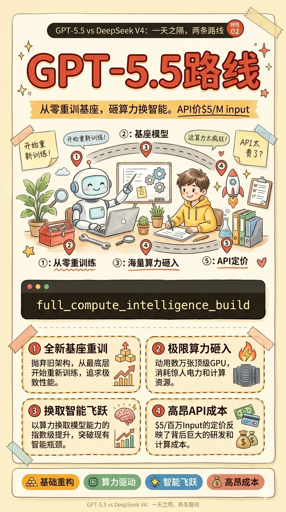
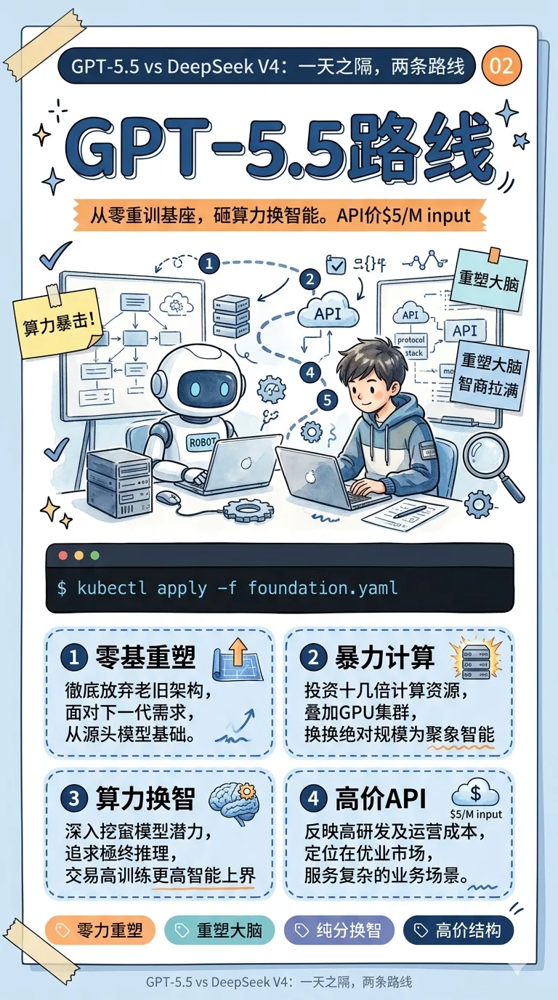
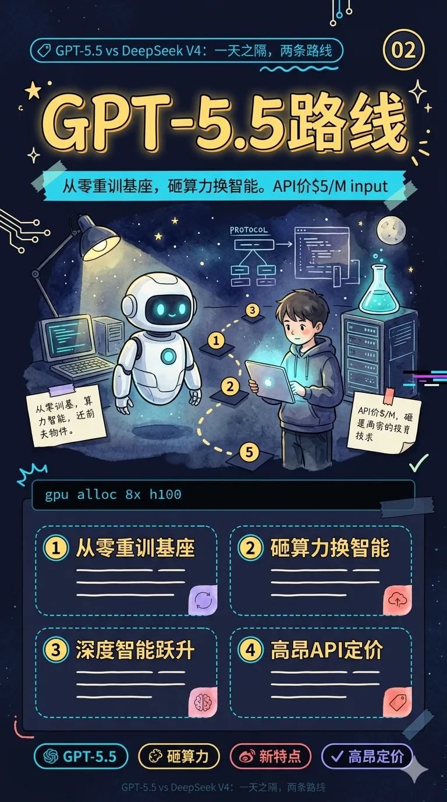
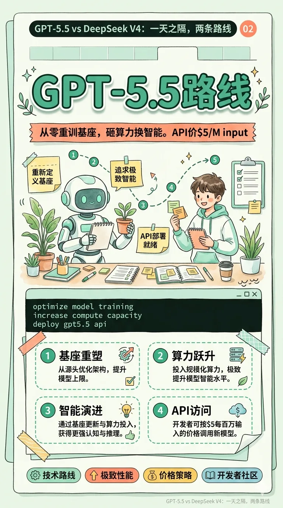

# 配图风格库(image-styles)

本目录下的每个 `<style>.json` 定义一种配图风格。风格用于两处:

1. **文章模式**(`publish.py --input article.md`)—— 文章内联图的视觉风格
2. **贴图模式**(`publish.py --type newspic --brief brief.md`)—— 贴图卡片的视觉风格

所有预览图都用**同一个样例主题 "Claude Code /rewind 命令"** 渲染,方便你横向比较风格差异。

---

## 两种模式,两套默认

- **文章(news)模式默认**:`hand-drawn-blue`(线条手绘蓝调)
- **贴图(newspic)模式默认**:`infographic-warm`(高密度手绘水彩信息图,暖黄配色)

两套默认是**有意分开**的 —— 文章里的配图是一图一意的插图(密度低),贴图整篇就是 6-10 张卡,每张需要自己承载完整信息(密度高)。**不要**把文章的 `hand-drawn-blue` 拿来当贴图用,效果会像"草稿"。

账号可以在 `accounts.yaml` 分别配 `image_style` 和 `newspic_image_style`:

```yaml
accounts:
  main:
    image_style: "hand-drawn-blue"        # 文章模式
    newspic_image_style: "infographic-warm"  # 贴图模式(参考图同款)
```

---

## 风格选择流程

1. 先看下面的**速查表**决定用哪一种风格
2. 预览图只是样例 —— 实际生成时会用你自己的内容
3. 在 `accounts.yaml` 的账号下配 `image_style: <name>` 和 `newspic_image_style: <name>`
4. 单篇要覆盖:`--image-style <name>`(CLI)或 brief.md frontmatter `image_style: <name>`

**优先级**:
- **文章**:CLI `--image-style` > frontmatter > 账号 `image_style` > `hand-drawn-blue`
- **贴图**:CLI `--image-style` > frontmatter > 账号 `newspic_image_style` > `infographic-warm`

---

## 风格速查表

| 风格 | 视觉关键词 | 最适合的话题 | 密度 | 贴图 | 文章 |
|---|---|---|---|---|---|
| [`tech-card-blue`](#tech-card-blue) | 浅蓝底 + 大字 + 极简 | 技术技巧、命令讲解、短观点 | 低 | ✅ | ✅ |
| [`hand-drawn-blue`](#hand-drawn-blue) | 手绘线条 + 蓝点缀 | 概念解释、架构图、流程图(全能选手) | 中 | ✅ | ✅ 默认 |
| [`illustrated-warm`](#illustrated-warm) | 暖橙 + 卡通人物 + 气泡 | 体验讲解、使用指南、亲切感强的技巧 | 中 | ✅ | ✅ |
| [`xiaohongshu-colorful`](#xiaohongshu-colorful) | 暖色渐变 + emoji + 大字 | 生活提示、上手指南、清单类 | 中 | ✅ | ✅ |
| [`quote-card-minimal`](#quote-card-minimal) | 黑白 + 衬线 + 留白 | 金句、观点、哲思 | 低 | ✅ | ❌ |
| [`magazine-editorial`](#magazine-editorial) | 米色 + 衬线 + 栏位感 | 深度评论、专栏、长篇随笔 | 中 | ✅ | ✅ |
| [`knowledge-card`](#knowledge-card) | 白底 + 编号 + 结构化 | 教程、方法论、清单、复习卡 | 中 | ✅ | ✅ |
| [`data-chart`](#data-chart) | 白底 + 图表 + 数字 | 数据观察、行业报告、对比 | 中 | ✅ | ✅ |
| [`meme-illustration`](#meme-illustration) | 黄底 + 卡通 + 对话气泡 | 吐槽、段子、行业梗 | 低 | ✅ | ✅ |
| [`infographic-warm`](#infographic-warm) ⭐ | 暖黄底 + 红橙手绘 + 卡通角色 | **贴图默认,通用话题** | **高** | ✅ | ✅ |
| [`infographic-blue`](#infographic-blue) 🔥 | 冷蓝底 + 橙色强调 + 卡通角色 | **SDK/协议/产品拆解** | **高** | ✅ | ✅ |
| [`infographic-dark`](#infographic-dark) 🔥 | 近黑底 + 霓虹青黄 + 卡通角色 | **前沿模型、基建、赛博** | **高** | ✅ | ✅ |
| [`infographic-mint`](#infographic-mint) 🔥 | 米白底 + 薄荷 + 珊瑚橙 + 卡通角色 | **生产力/工具/方法论** | **高** | ✅ | ✅ |

### ⭐🔥 手绘水彩信息图系列 (v3 重写)

**4 种配色共享同一视觉语言**:手绘水彩 + 墨线插画 + 卡通机器人&男孩角色 + 多区块高密度版面,像一页日本/台湾科普绘本或杂志插页。**对标参考**:[GPT-5.5 来了](https://mp.weixin.qq.com/s/nSlGjh9hjM63jxz_jgUCwA)。

**8 个版面区块**(每张贴图都包含):
1. 顶部小标签(话题 + 卡片序号)
2. 粗体手绘大标题(带描边阴影)
3. 副标题横条胶带
4. 中部水彩插画场景(机器人+男孩+道具+编号路径)
5. 仿 terminal 黑条(英文短命令)
6. 2×2 要点小卡网格(4 个子点,带圆数字)
7. 底部彩色标签胶囊带
8. 页脚水印

**选配色的建议**:
- 不确定 / 通用 / 人文 / AI 产品 → `infographic-warm`(**默认**,暖黄参考图同款)
- 技术拆解 / SDK / 协议 / 商务分析 → `infographic-blue`(冷蓝)
- 前沿模型 / 基建 / 赛博 / 深夜科技 → `infographic-dark`(深夜档案)
- 生产力 / 工具 / 方法论 / 学习笔记 → `infographic-mint`(薄荷清新)

**⚠️ 使用前提**:要点本身要有具体信息(数字、名词、对比、步骤),AI 才能把子点渲染成 2×2 网格里的真内容。如果要点只有一句抽象观点,AI 会编数字 —— 那种情况下不如用 `tech-card-blue` 做极简大字卡更稳。

---

## 风格详细说明

### tech-card-blue

浅蓝底 + 深蓝大字 + 极少装饰。**对标微信示例文章 [Claude Code /rewind](https://mp.weixin.qq.com/s/erEF74HRGkrBPxTGsKDsSQ)**。
每张卡一个观点或一条命令,字体占视觉主导,留白充足。

<table>
<tr><td width="300">

</td><td>

- **主题色**:`#f4f7ff` 底 / `#2e5bff` 蓝 / `#0b1530` 墨
- **排版**:正方 1:1,思源黑体 Heavy
- **账号绑定**:`tech`(蒜是哪根葱)默认
- **最适合**:技术命令讲解、开发者 tips、短观点
- **别用在**:长文深度解析(信息密度不够)

</td></tr></table>

---

### hand-drawn-blue

手绘速写风 + 蓝色点缀 + 白底,像工程师的笔记本。擅长画流程、架构、对比、概念示意。
**main 号默认**,视觉一致度高,话题适配最广。

<table>
<tr><td width="300">

</td><td>

- **主题色**:`#ffffff` 底 / `#4a6cf7` 蓝 / `#ff8c42` 橙
- **排版**:支持 1:1 贴图 / 16:9 文章,手写风字体
- **账号绑定**:`main`(刷屏AI)默认
- **最适合**:AI / 产品 / 工程话题的全能默认
- **别用在**:纯数据报告(换 `data-chart`)、纯金句(换 `quote-card-minimal`)

</td></tr></table>

---

### illustrated-warm

暖橙 / 桃色渐变底 + 卡通人物场景 + 大白气泡 + 手绘装饰。每张卡像一页小漫画,讲一个小故事。
**对标公众号示例文章 [Claude Code /rewind](https://mp.weixin.qq.com/s/erEF74HRGkrBPxTGsKDsSQ)**。视觉有温度、带情绪、有人物在场,适合"给你讲一件事"感觉的内容。

<table>
<tr><td width="300">

</td><td>

- **主题色**:`#ffd9b3 → #ffa07a` 暖橙渐变 / `#4ecdc4` 青 / `#a78bfa` 紫 / `#fde047` 黄
- **排版**:3:4 竖图(贴图)/ 4:3(文章),粗圆体 + 手写感
- **账号绑定**:(main 号讲使用体验时首选)
- **最适合**:工具使用讲解、体验分享、故事卡、亲切感强的"指南"
- **别用在**:冷话题(数据、架构、协议),情绪不匹配时看着反而跳

</td></tr></table>

---

### xiaohongshu-colorful

暖色渐变背景 + emoji + 大字 + 黄色笔刷高亮,典型的小红书 / Instagram 封面感。
活泼、友好、转化率高。

<table>
<tr><td width="300">

</td><td>

- **主题色**:`#ffecd2 → #fcb69f` 渐变 / `#ff6b6b` 红 / `#ffd93d` 黄
- **排版**:3:4 竖图(贴图)/ 16:9(文章)
- **账号绑定**:(可选,main 号做生活类时用)
- **最适合**:上手指南、清单盘点、生活提示、轻话题
- **别用在**:tech 号葱哥(冷幽默和彩色完全不搭)

</td></tr></table>

---

### quote-card-minimal

黑白极简 + 衬线大字 + 留白极致。一张卡一句金句,像美术馆墙上的引文。
**只推荐贴图模式**,文章内联用会太冷清。

<table>
<tr><td width="300">

</td><td>

- **主题色**:`#f7f5f0` 米白 / `#1a1a1a` 墨黑 / `#8a8a8a` 灰
- **排版**:1:1,思源宋体 Heavy
- **账号绑定**:(tech 号葱哥最适合)
- **最适合**:观点金句、哲思、收尾页、单独一句话
- **别用在**:多信息卡(一张塞不下超过 15 字的会崩)

</td></tr></table>

---

### magazine-editorial

米色暖底 + 衬线大标题 + 栏位感 + 栗色点缀。像杂志内页,有温度也有距离感。
文章开头配一张,全文格调瞬间提一档。

<table>
<tr><td width="300">

</td><td>

- **主题色**:`#f5efe6` 米色 / `#7a2e2e` 栗 / `#4a5d3a` 墨绿
- **排版**:4:5 竖图(贴图)/ 16:9(文章),思源宋体 Heavy
- **账号绑定**:(深度评论专栏用)
- **最适合**:深度观察、行业评论、文化思考、长篇随笔
- **搭配主题**:`sage-premium` / `warm-editorial` 效果最好

</td></tr></table>

---

### knowledge-card

白底 + 浅灰栅格 + 蓝色编号徽章 + 琥珀色小结。结构化学习卡的标准模板。
信息密度高,视觉识别度高,读者一眼就知道"这是要记的"。

<table>
<tr><td width="300">

</td><td>

- **主题色**:`#ffffff` 底 / `#2563eb` 蓝 / `#f59e0b` 琥珀
- **排版**:3:4(贴图)/ 16:9(文章),思源黑体 Bold
- **账号绑定**:(工具教程、方法论类用)
- **最适合**:教程步骤、方法框架、清单、概念拆解
- **别用在**:情绪型内容、纯金句(两者都换 `quote-card-minimal`)

</td></tr></table>

---

### data-chart

白底 + 栅格 + 柱图 / 折线 / 饼图 + 等宽数字。FiveThirtyEight / Bloomberg 数据图美学。
**只有真实数字才用这个风格** —— 编数据会掉粉比 AI 味还严重。

<table>
<tr><td width="300">

</td><td>

- **主题色**:`#fafbfc` 底 / `#0ea5e9` 蓝 / `#ef4444` 红 / `#10b981` 绿
- **排版**:1:1(贴图)/ 16:9(文章),JetBrains Mono 等宽数字
- **账号绑定**:(有数据的文章通用)
- **最适合**:趋势分析、榜单、行业报告、benchmark 对比
- **硬要求**:必须有真实可引用的数据源

</td></tr></table>

---

### meme-illustration

黄底 + 卡通人物 + 对话气泡 + 夸张表情。互联网 meme 风格,专治严肃。
**慎用**:meme 有保鲜期,过时的梗比没梗还尴尬。

<table>
<tr><td width="300">

</td><td>

- **主题色**:`#fff9e6` 黄底 / `#ff5e5e` 红 / `#4ecdc4` 青 / `#2d2d2d` 黑线
- **排版**:1:1(贴图)/ 4:3(文章),粗黑体 + 手写风
- **账号绑定**:(tech 号文末吐槽)
- **最适合**:吐槽、行业段子、相亲相爱型梗、程序员幽默
- **别用在**:严肃观点、首图、跟客户 / 品牌合作的文章

</td></tr></table>

---

### infographic-warm ⭐(贴图默认)

暖米黄底 + 红橙手绘大标题 + 卡通机器人&男孩 + 水彩多区块。对标参考:[GPT-5.5 来了](https://mp.weixin.qq.com/s/nSlGjh9hjM63jxz_jgUCwA)。

<table>
<tr><td width="300">

</td><td>

- **主题色**:`#faf0d4` 暖米黄 / `#e8543a` 红橙(标题) / `#f5a623` 琥珀 / `#3a2a1c` 深棕文字
- **排版**:9:16 竖版(1080x1920),手写粗体标题 + 思源黑体正文
- **视觉语言**:手绘水彩 + 墨线 + 纸张纹理,绝不用 flat vector / 3D
- **主角**:白色圆润机器人(蓝眼)+ 黄卫衣小男孩,8 区块版面
- **最适合**:贴图模式默认、AI 产品、工具讲解、人文趋势、通用话题
- **别用在**:如果你只想要一句金句大字卡(用 `quote-card-minimal`)

</td></tr></table>

---

### infographic-blue 🔥

和 warm 同一手绘水彩语言,但换冷蓝基底 + 橙色强调,工程师气质。

<table>
<tr><td width="300">

</td><td>

- **主题色**:`#eaf2fb` 淡蓝 / `#2a62a8` 海军蓝(标题) / `#f58a3a` 橙 / `#102a44` 墨蓝文字
- **排版**:9:16 竖版,同 warm 的 8 区块版面
- **主角**:同一套机器人&男孩,但服装换冷色系,场景多服务器/架构图/协议栈
- **最适合**:SDK 拆解、协议对比、基础设施、产品评测、商务/技术并重的话题
- **别用在**:生活化话题、情绪型内容

</td></tr></table>

---

### infographic-dark 🔥

同视觉语言的深色变体。深靛蓝夜空底 + 霓虹青黄手绘,像夜间实验室档案。

<table>
<tr><td width="300">

</td><td>

- **主题色**:`#151a2e` 深靛蓝夜 / `#fde38a` 亮黄(标题) / `#22d3ee` 霓虹青 / `#f1ecd8` 奶油文字
- **排版**:9:16 竖版,同 8 区块版面
- **主角**:白色机器人(霓虹青眼)+ 深色帽衫男孩,拿发光屏幕,夜间场景
- **最适合**:前沿模型发布、协议规范、基建/安全、赛博话题
- **别用在**:生活化 / 温暖向 / 面向非技术读者的话题

</td></tr></table>

---

### infographic-mint 🔥

同视觉语言的清新变体。米白底 + 薄荷绿 + 珊瑚橙,友好感强。

<table>
<tr><td width="300">

</td><td>

- **主题色**:`#f2f8ef` 淡薄荷 / `#2d9e7a` 薄荷绿(标题) / `#ff7b5d` 珊瑚 / `#1e2a26` 森林文字
- **排版**:9:16 竖版,同 8 区块版面
- **主角**:机器人(薄荷眼)+ 白/薄荷卫衣男孩,场景多桌面植物/便利贴/咖啡
- **最适合**:生产力 / 工具使用 / 方法论 / 学习笔记 / 轻科普
- **别用在**:严肃商业分析、赛博话题

</td></tr></table>

---

## 新增一种风格

1. 在 `assets/image-styles/` 下复制一个现有 `.json` 作模板
2. 改 `style_name`(文件名同步改)、`display_name`、`description`
3. 设计 `prompt_template.newspic_card` 和 `prompt_template.article_inline`,可用占位符:
   - `{topic}` — brief.md 的 topic 字段
   - `{card_main}` / `{card_sub}` — 切分后的卡片主/副文字(老风格用这两个)
   - `{point_full}` — 完整原始要点(未切分),信息图类新风格用这个拿更多上下文
   - `{card_index}` / `{card_total}` — "01" / "06",渲染卡片序号
   - `{image_subject}` — "topic - card_main" 拼接,兼容用
4. 用 `baoyu-danger-gemini-web` 按 `newspic_card` prompt 生成一张 1:1 预览图,然后 `cwebp -q 85 src.png -o previews/<style_name>.webp`(PNG 在 repo 里会占 10-20 倍空间)
5. 在本 README 加一行速查表 + 一个详细块
6. `python3 scripts/wechat_api.py list-image-styles` 验证能读出

---

## 调试

```bash
# 列出所有已注册风格
python3 scripts/wechat_api.py list-image-styles

# 看某个风格的完整 JSON
cat assets/image-styles/tech-card-blue.json | python3 -m json.tool

# 单独跑拆卡 + 出图计划(不实际生图)
python3 scripts/newspic_build.py brief.md --dry-run
```
